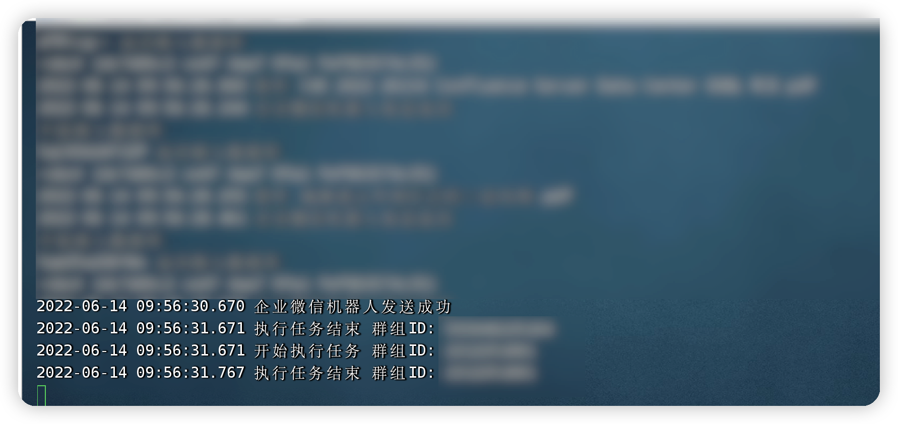
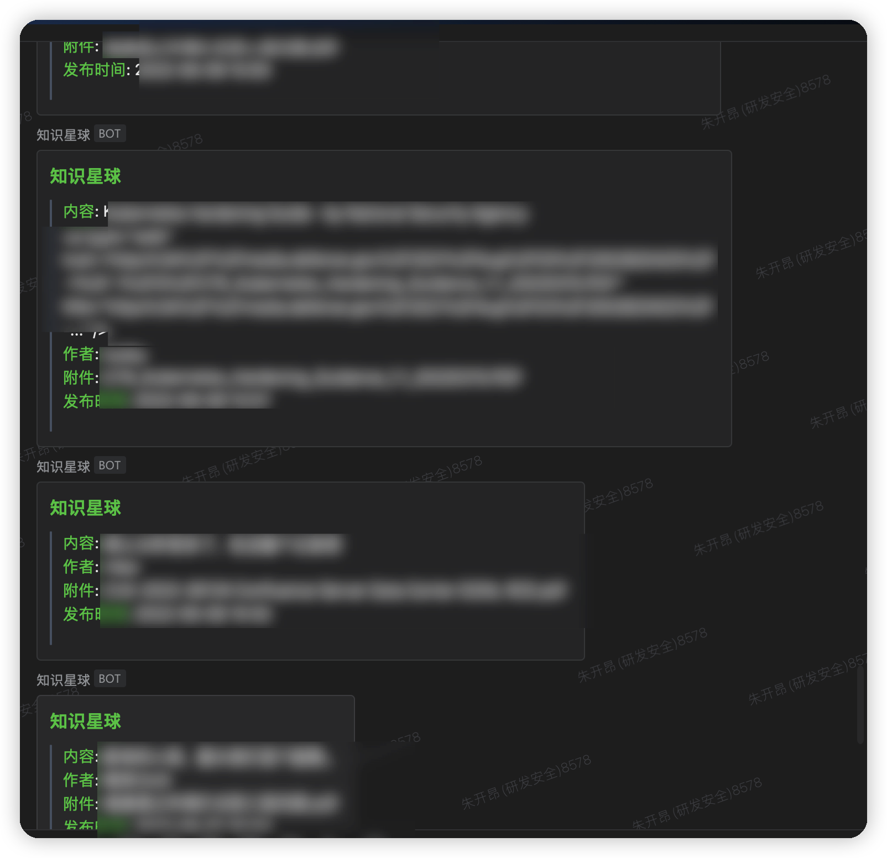

# zsxq_notice

知识星球提醒

## 指南：

#### 下载

```
git clone https://github.com/tangxiaofeng7/zsxq_notice.git
cd zsxq_notice
```

#### 启动/安装 mysql

```
yum -y install mysql-server mysql mysql-devel
service mysqld start
chkconfig mysqld on
mysql_secure_installation
```

#### 登陆 mysql 并导入 sql 文件

mysql -uroot -p
source mysql/init.sql

#### 编辑配置文件

vim config/config.yaml

```
# 数据库连接信息
database:
  default:
    type:  "mysql"
    link:  "root:c!vG?2R4@tcp(127.0.0.1:3306)/zsxq"

# 企业微信机器人
wechat:
    key:    "dc7d86c2-ce47-4aa7-9fa1-111111111111"

# 知识星球token
zsxq_access_token:
    token:    "DFD51610-752F-369F-1BC7-1287690C57B0_1111111111111111"

# 需要提醒的知识星球id
zsxq_group:
  - id: "11111111111"
  - id: "2222222222222"

```

#### 后台启动 main

./main

#### 运行截图



#### 效果图


